# Enunciado ejercicios básicos de Git, GitHub (Parte 1)
# Repositorio masterpidgey-examen
### Crear un repositorio en vuestro GitHub llamado masterpidgey-examen.
- Creamos el repositorio de examen desde el github

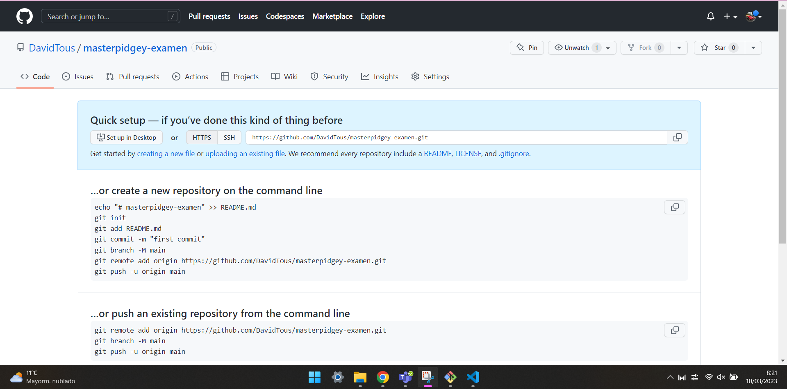
### Clonar vuestro repositio en local.
- git clone https://github.com/DavidTous/masterpidgey-examen.git

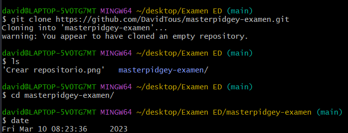
### README
Crear (si no lo habéis creado ya) en vuestro repositorio local un documento README.md.
- git touch README.md

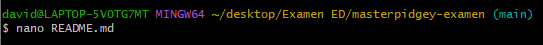
Y añadimos el README.md
- git add README.md

### Commit inicial
Añadir al README.md los comandos utilizados hasta ahora y hacer un coomit inicial con el mensaje commit inicial.
- git commit -m "commit inicial"

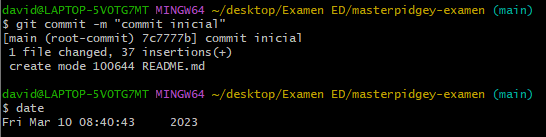

### Push inicial
Subir los cambios al repositorio remoto.
- git push -u origin main

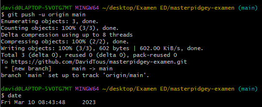

### Ignorar archivos
Crear en el repositorio local un fichero llamado privado.txt.
- touch privado.txt

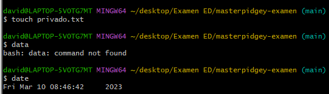

Crear en el repositorio local una carpeta llamada privada.
- mkdir privada

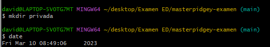

Realizar los cambios oportunos para que tanto el archivo como la carpeta sean ignorados por git.
- nano .gitignore

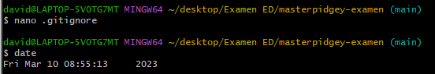

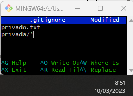

### Añadir fichero 1.txt
Añadir fichero 1.txt al repositorio local.
- touch 1.txt

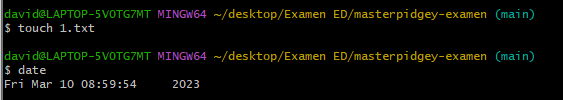
- git add 1.txt

# Visualizar los commits realizados hasta el momento
- git log

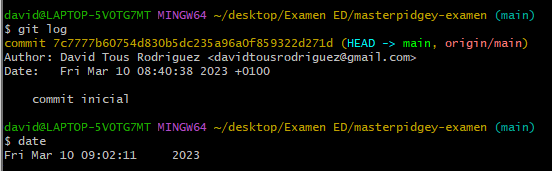
### Crear el tag v0.1
- git tag -a v0.1

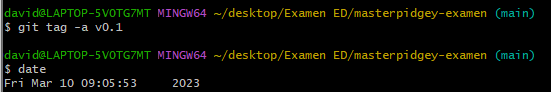
### Subir el tag v0.1
Subir los cambios al repositorio remoto.
- git push --tags

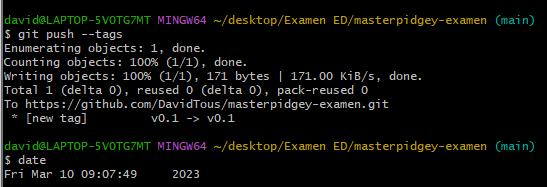
# Visualizar de nuevo los commits realizados hasta el momento
- git log

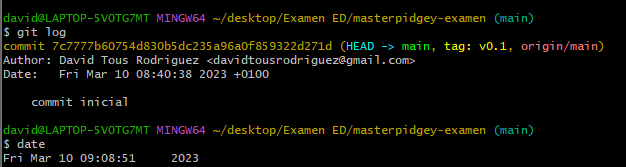
### Crear una tabla
Crear una tabla de este estilo en el fichero README.md con la información del docente del módulo:
| Nombre | Github |
| ------ | ------ |
| Maximo | [enlace github](https://github.com/maximofernandezriera) |
### Colaboradores
Poner a github.com/maximofernandezriera como colaborador del repositorio masterpidgey-examen

# Contribución guiada a un proyecto (Simulación examen parte 2)
### Contribución al proyecto first-contributions

1. Realizamos un fork del repositorio
Realiza un fork del repositorio haciendo un clic en el botón fork de la parte superior de la página. Esto creará una instancia del repositorio completo en tu cuenta.

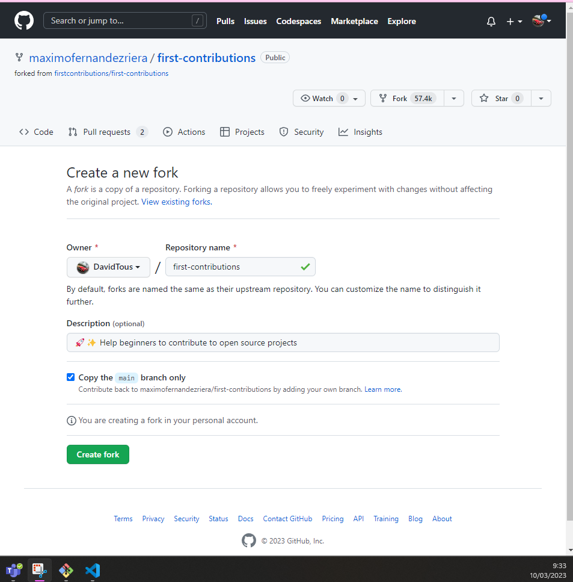

2. Clona el repositorio
Una vez que el repositorio esté en tu cuenta, clónalo a tu ordenador para trabajarlo localmente.

- git clone https://github.com/DavidTous/first-contributions.git

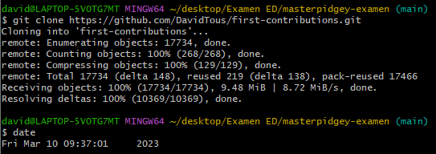

Ahora hemos configurado una copia de la rama maestra desde el repositorio principal del proyecto en línea.

Debemos ir al repositorio clonado ejecutando el siguiente comando:

- cd first-contributions/

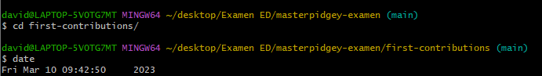

3. Crea una rama
Es una buena práctica crear una rama (branch) nueva cuando trabajas con repositorios, ya sea que se trate de un proyecto pequeño o estés contribuyendo en un equipo de trabajo.

El nombre de la rama debe ser breve y debe reflejar el trabajo que estamos haciendo.

- git checkout -b rama

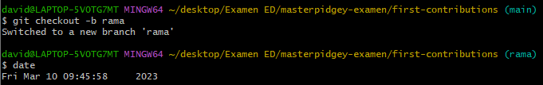

4. Realiza cambios y confírmalos
Has cambios esenciales al proyecto y guárdalos.
Creamos un fichero
- nano fichero.txt

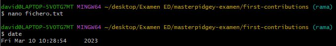

- git status

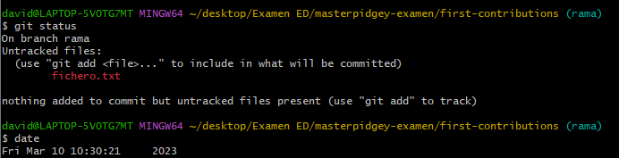
Agrega esos cambios a la rama recién creada usando el comando git add:

- git add .

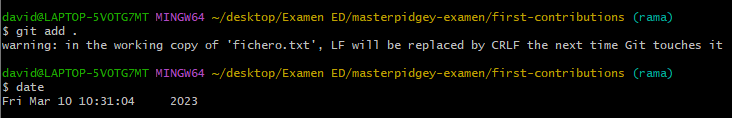

Ahora confirma esos cambios utilizando el comando git commit:

- git commit -m "commit rama"

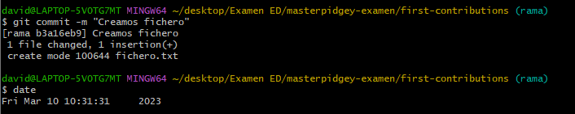

5. Envía los cambios a GitHub
Para enviar los cambios a GitHub, debemos identificar el nombre del repositorio remoto.

- git remote

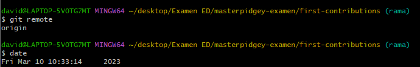

Para este repositorio el nombre es "origin".

Luego de identificar el nombre podemos enviar en forma segura los cambios a GitHub.

- git push origin rama

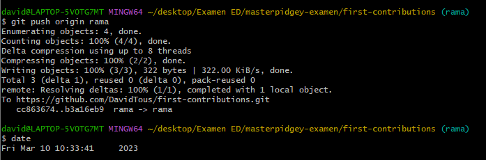

6. Crea un pull request
Ve a tu repositorio en GitHub y verás un botón llamado "Pull request", has clic en él.

Por favor, provee todos los detalles necesarios de lo que has hecho. Ahora, envía el pull request.

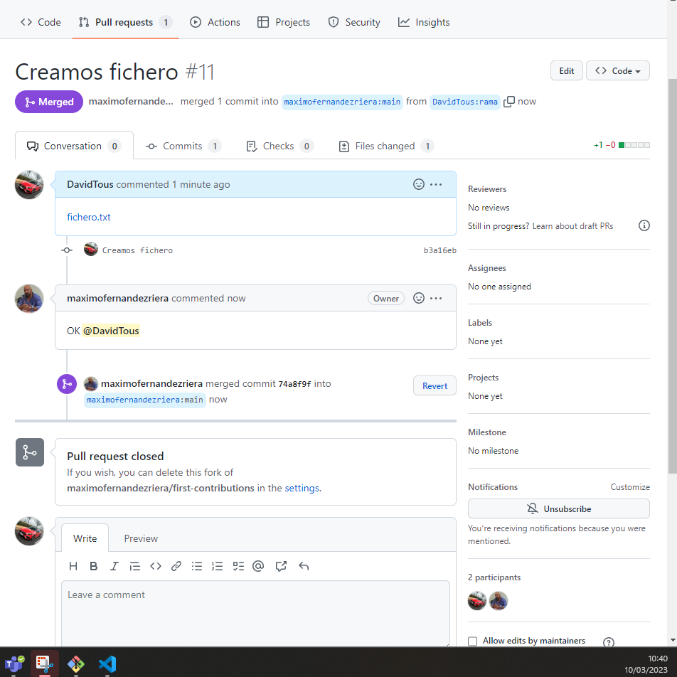

7. Sincroniza tu rama maestra con la del repositorio original
Antes de enviar cualquier pull request al repositorio original debes sincronizar tu repositorio con aquel.

Primero, revisamos en que rama estás ubicado.
- git branch

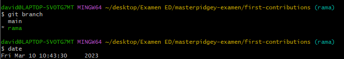
Esto enumerará todas las ramas y indicará en verde la rama actual o activa.

2. Cambia a la rama maestra.

- git checkout main

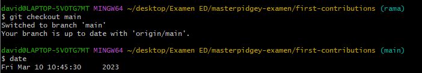

3. Agrega el repositorio original como un repositorio upstream.

Para poder extraer los cambios desde el repositorio original a tu versión local, necesitas agregar el repositorio Git original como un repositorio upstream.

- git remote add upstream https://github.com/maximofernandezriera/first-contributions.git

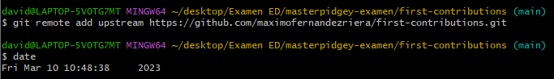

4. Busca (fetch) el repositorio.

Busca todos los cambios  del repositorio original. Las confirmaciones (commits) del repositorio original serán almacenadas en una rama local llamada upstream/master.

- git fetch upstream
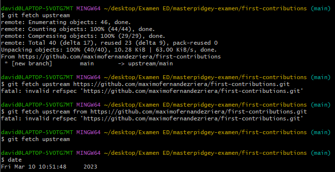
5. Fusionala.

Fusiona los cambios de la rama upstream/master a tu rama maestra local. Esto hará que tu rama maestra se sincronice con el repositorio upstream sin perder tus cambios locales.

- git merge upstream/main
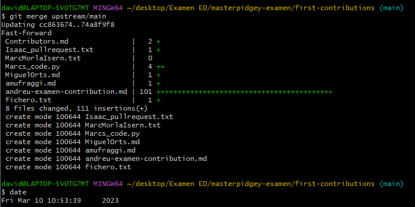
6. Envía (push) los cambios a GitHub

En este punto tu rama local está sincronizada con la rama maestra del repositorio original. Si deseas actualizar el repositorio de GitHub, necesitas enviar tus cambios.

- git push origin main
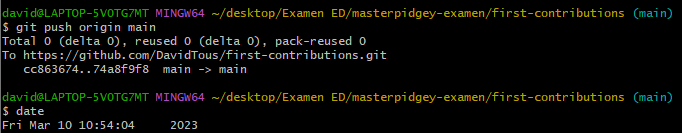

Y con esta practica enseñamos todos los conocimientos que tenemos de git.